# Azure Multi-Honeypot Lab: Detection & Triage of Real-World Attacks with Splunk

## Overview

I built and monitored two internet-exposed honeypots — a Windows RDP host and a Linux/Cowrie SSH host — to generate real attacker telemetry and practice the core workflow of a SOC analyst end to end: **collect → detect → investigate → enrich → report**.

Rather than using a pre-built SIEM connector (e.g. Microsoft Sentinel's honeypot integrations), I centralized both attack surfaces into **Splunk Enterprise** and wrote the detection logic, correlation searches, and GeoIP enrichment myself. This let me practice not just "standing up infrastructure," but the actual analyst tasks that follow: triaging alerts, pivoting on an indicator, distinguishing automated noise from meaningful signal, and writing up findings the way I would on shift.

Within hours of exposure, both honeypots captured real, unsolicited attack traffic from across the globe. This repo documents the build, the detections I wrote, and — most importantly — what I found when I actually investigated the traffic.

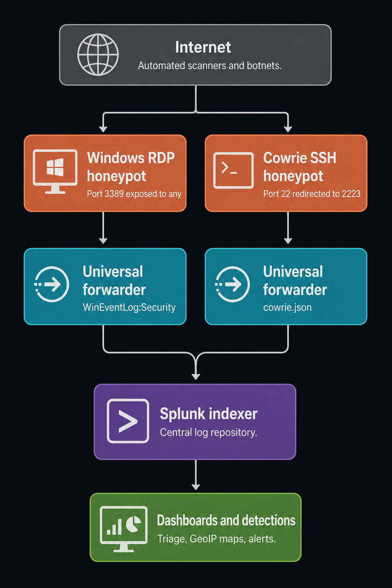

---

## Key Findings (Analyst Summary)

Before the step-by-step build, here's what the investigation actually turned up — the part a SOC analyst role cares about most:

- **Both honeypots were discovered and attacked by automated tooling within hours of exposure** (SSH within ~7 minutes of going live), confirming that unprotected RDP/SSH services are found by internet-wide scanning infrastructure almost immediately, not eventually.
- **Attack traffic was dominated by a small number of source IPs generating high-volume, scripted brute-force attempts** — one RDP attacker generated a login attempt roughly every 1.7 seconds, a pattern with zero plausible human explanation.
- **Every successful SSH "login" was immediately followed by an identical automated recon script** (checking CPU, architecture, GPU, and logged-in users) — this is a stronger, higher-fidelity indicator of malicious automation than a login attempt alone, and became one of my custom detections (see [`DetectionRules.md`](DetectionRules.md)).
- **GeoIP enrichment traced attacker infrastructure to commercial hosting providers** (e.g. Flyservers S.A., a Panama-registered host with Lithuania-based infrastructure) rather than residential IPs — consistent with attackers renting cheap VPS infrastructure to run scanning tools rather than exposing themselves directly.
- **Full findings, IOCs, and a recommended response are documented in [`IncidentReport.md`](IncidentReport.md)**, written in the format I'd use for a real ticket.

---

## Table of Contents

- [Key Findings](#key-findings-analyst-summary)
- [Step 1: Building the Network](#step-1-building-the-network)
- [Step 2: Deploying the RDP Honeypot](#step-2-deploying-the-rdp-honeypot)
- [Step 3: Deploying the Splunk Indexer](#step-3-deploying-the-splunk-indexer)
- [Step 4: Forwarding RDP Logs to Splunk](#step-4-forwarding-rdp-logs-to-splunk)
- [Step 5: Triage — First Real Alert (RDP)](#step-5-triage--first-real-alert-rdp)
- [Step 6: Writing the Brute-Force Detection](#step-6-writing-the-brute-force-detection)
- [Step 7: Enrichment — GeoIP & Attribution](#step-7-enrichment--geoip--attribution)
- [Step 8: Deploying the Cowrie SSH Honeypot](#step-8-deploying-the-cowrie-ssh-honeypot)
- [Step 9: Triage — First Real Alert (SSH)](#step-9-triage--first-real-alert-ssh)
- [Step 10: Investigating Post-Access Behavior](#step-10-investigating-post-access-behavior)
- [Step 11: Correlating Both Attack Surfaces](#step-11-correlating-both-attack-surfaces)
- [Step 12: Final Analyst Dashboard](#step-12-final-analyst-dashboard)
- [Skills Demonstrated](#skills-demonstrated)
- [Supporting Documents](#supporting-documents)
- [Lessons Learned](#lessons-learned)

---

## Step 1: Building the Network

Created a resource group and virtual network (`honeypot-vnet`, 10.0.0.0/24) in Azure to host all lab infrastructure on a shared private network — establishing the environment I'd be monitoring.

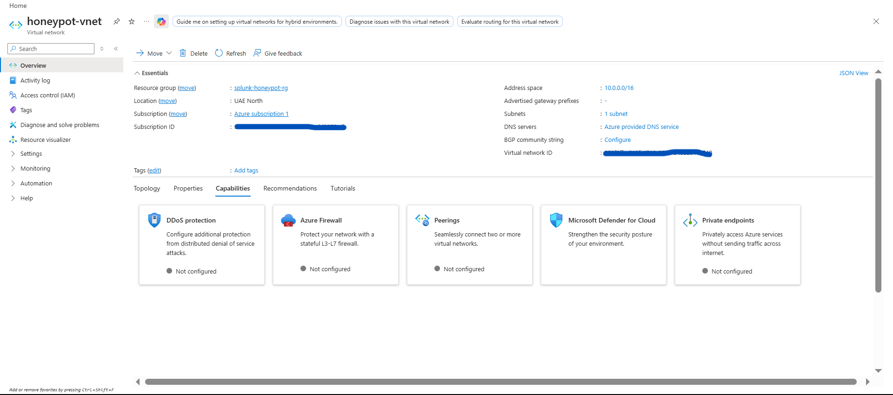

## Step 2: Deploying the RDP Honeypot

Deployed a Windows Server VM configured to be intentionally vulnerable: public IP, weak administrator credentials, Windows Firewall disabled across all profiles. The goal was to generate realistic attacker telemetry, not to test my own defenses.


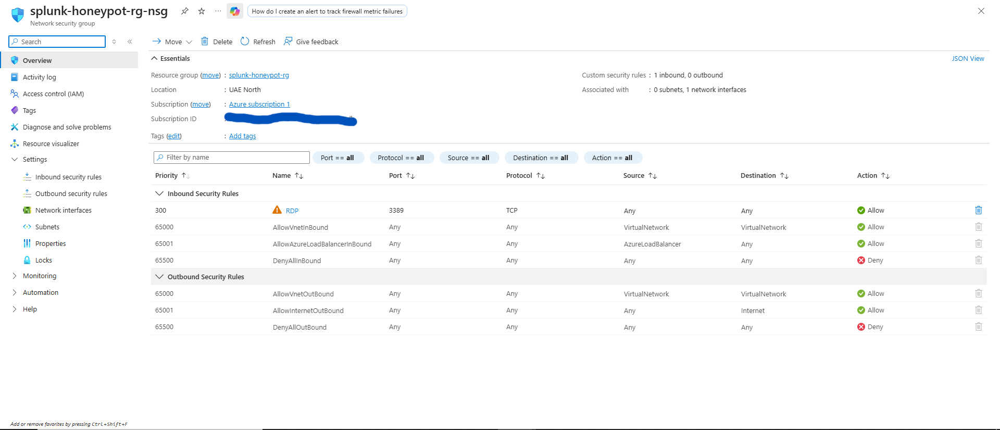


## Step 3: Deploying the Splunk Indexer

Deployed a separate Ubuntu VM to run Splunk Enterprise as the central log repository — the "single pane of glass" a SOC analyst would actually work out of, rather than checking each honeypot's local logs individually.

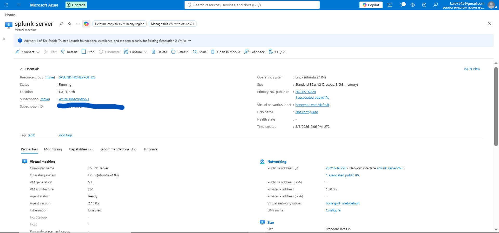
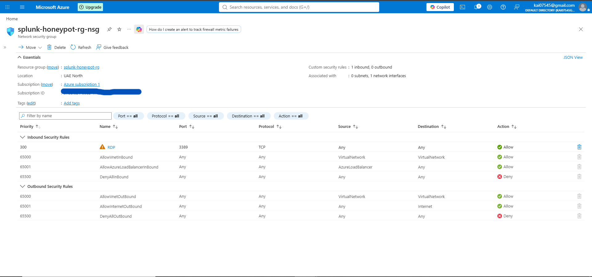

## Step 4: Forwarding RDP Logs to Splunk

Configured a Splunk Universal Forwarder to ship Windows Security event logs to the indexer in near real time — the log pipeline every downstream detection in this project depends on.


## Step 5: Triage — First Real Alert (RDP)

This is where the analyst work actually starts. Within hours of exposure, real external authentication attempts (`EventCode 4625`) appeared in Splunk. My first step, same as I'd do on shift, was to confirm this wasn't internal noise (Azure health checks, my own RDP sessions) before treating it as a genuine event.

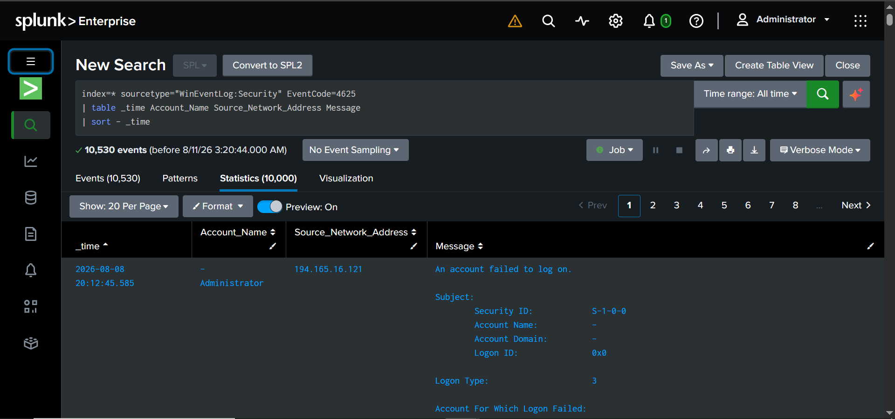

```spl
index=* sourcetype="WinEventLog:Security" EventCode=4625
| table _time Account_Name Source_Network_Address Message
| sort - _time
```

**Triage note:** confirmed the source IP was external and non-Azure before proceeding — ruling out false positives is step one, not an afterthought.

## Step 6: Writing the Brute-Force Detection

Rather than eyeballing the raw event stream, I wrote a rate-based detection to automatically flag any single IP generating an abnormal volume of failed logons in a short window. This turned "I see some failed logins" into "this specific IP is doing something a human wouldn't do."

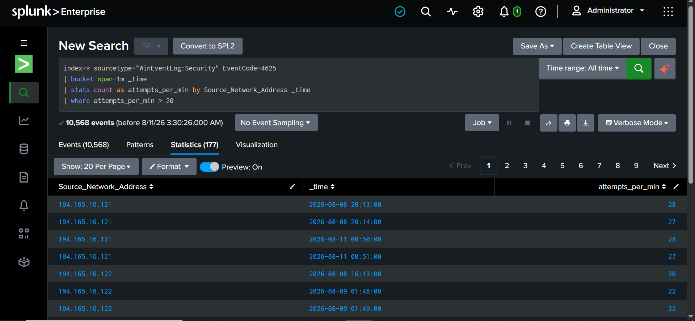

```spl
index=* sourcetype="WinEventLog:Security" EventCode=4625
| bucket span=1m _time
| stats count as attempts_per_min by Source_Network_Address _time
| where attempts_per_min > 20
```

**Finding:** the flagged IP was generating attempts roughly every 1.7 seconds — confirmed automated tooling, not a user who forgot their password. Full detection writeup, including threshold rationale and false-positive considerations, in [`DetectionRules.md`](DetectionRules.md).

## Step 7: Enrichment — GeoIP & Attribution

Once an IP is confirmed malicious, the next analyst step is context: where is this coming from, and is it something we've seen before?

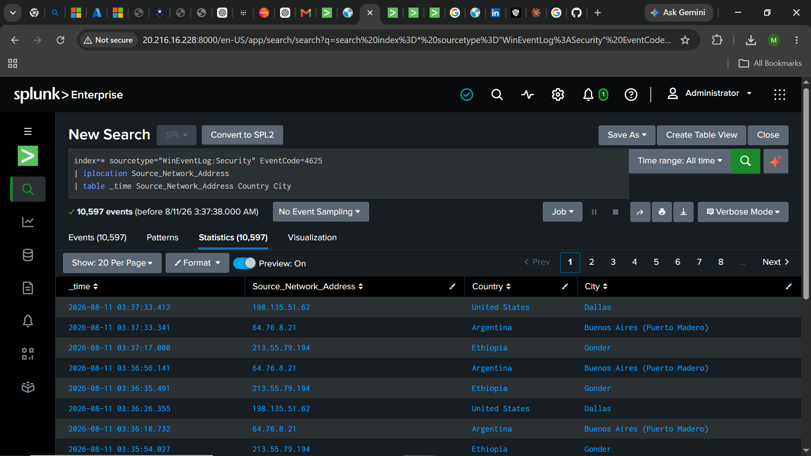

```spl
index=* sourcetype="WinEventLog:Security" EventCode=4625
| iplocation Source_Network_Address
| table _time Source_Network_Address Country City
```

I took this a step further and manually pivoted on the attacker IP with a WHOIS lookup, tracing it to **Flyservers S.A.**, a commercial hosting provider — not a residential connection. This is a meaningful distinction for an analyst to note: it indicates rented infrastructure used for scanning, which changes the response recommendation (block and move on) versus a compromised residential device (which might warrant different handling in a real investigation).

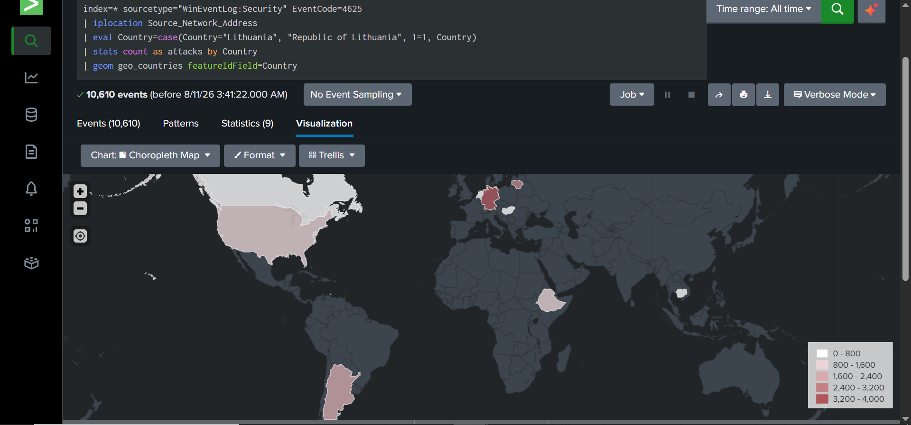

```spl
index=* sourcetype="WinEventLog:Security" EventCode=4625
| iplocation Source_Network_Address
| eval Country=case(Country="Lithuania", "Republic of Lithuania", 1=1, Country)
| stats count as attacks by Country
| geom geo_countries featureIdField=Country
```

## Step 8: Deploying the Cowrie SSH Honeypot

Windows Security logs can confirm *that* someone tried to log in, but not *what they did next* or *what credentials they used* — a real limitation for an analyst trying to build a full picture. I deployed **Cowrie**, an application-layer SSH honeypot that simulates a real shell, to close that gap.


## Step 9: Triage — First Real Alert (SSH)

Cowrie captured its first attacker within ~7 minutes of going live — a bot cycling through common credential pairs (`admin/adminroot`, `user/user`, `user/123456`, etc.).

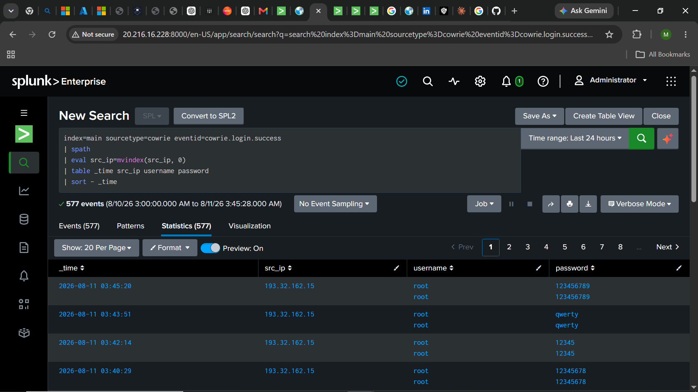

```spl
index=main sourcetype=cowrie eventid=cowrie.login.success
| spath
| eval src_ip=mvindex(src_ip, 0)
| stats count as attempts values(username) as usernames values(password) as passwords by src_ip
| sort - attempts
```

**Triage note:** the same source IP tested eight different credential pairs across five separate sessions in under four minutes — clearly wordlist-driven, not a targeted human attempt.

## Step 10: Investigating Post-Access Behavior

This is the step that separates "logged an alert" from "actually investigated it." Every accepted Cowrie login was immediately followed by the same command block — a system fingerprinting script.

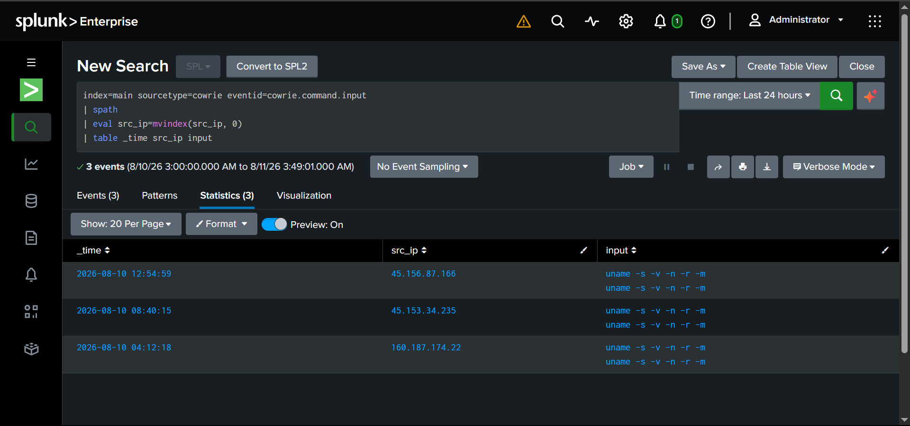

```spl
index=main sourcetype=cowrie eventid=cowrie.command.input
| spath
| eval src_ip=mvindex(src_ip, 0)
| table _time src_ip input
```

**Finding:** the identical script appeared across multiple *unrelated* source IPs, indicating a shared, widely distributed botnet toolkit rather than isolated custom activity. I wrote a dedicated detection for this specific script signature — see `DET-003` in [`DetectionRules.md`](DetectionRules.md) — since a confirmed recon script is a much higher-confidence signal than a login attempt alone, and would be a priority escalation in a real environment.

Full attacker-by-attacker investigation, timeline, IOCs, and recommended response actions are documented in [`IncidentReport.md`](IncidentReport.md).

## Step 11: Correlating Both Attack Surfaces

The last analyst step was correlation — pulling both honeypots into a single view to answer "what does our overall exposure look like," not just "what happened on one host."

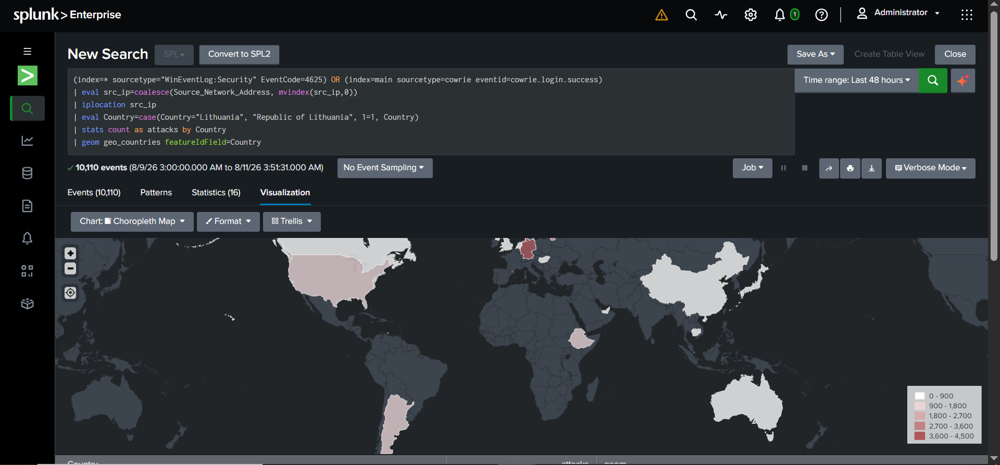

```spl
(index=* sourcetype="WinEventLog:Security" EventCode=4625) OR (index=main sourcetype=cowrie eventid=cowrie.login.success)
| eval src_ip=coalesce(Source_Network_Address, mvindex(src_ip,0))
| iplocation src_ip
| eval Country=case(Country="Lithuania", "Republic of Lithuania", 1=1, Country)
| stats count as attacks by Country
| geom geo_countries featureIdField=Country
```

## Step 12: Final Analyst Dashboard

The finished dashboard is built the way a shift dashboard should be: total volume at a glance, geographic spread, a time trend to spot spikes, and a ranked table of the highest-priority IPs — everything needed to triage at the start of a shift without running ad-hoc searches first.


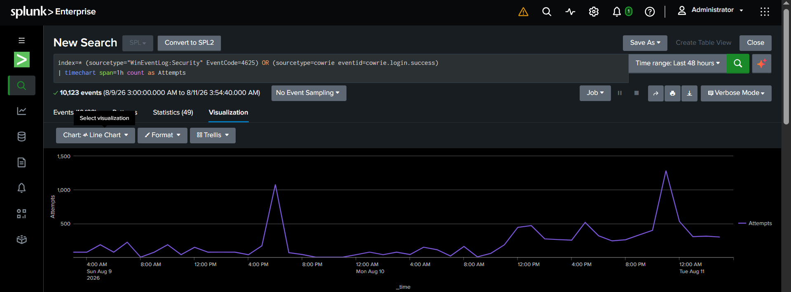
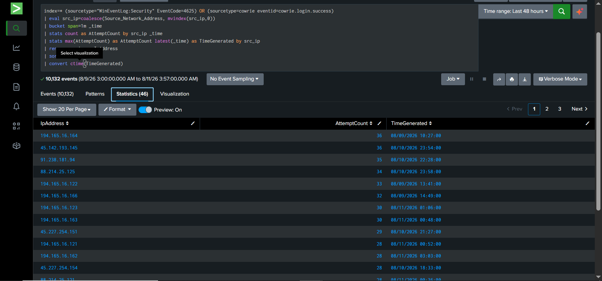
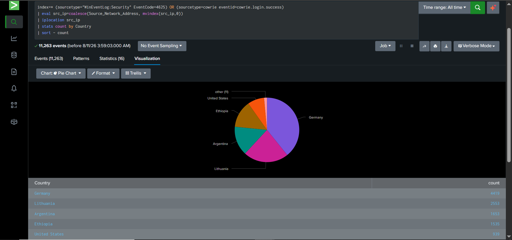


---

## Skills Demonstrated

**Analyst / SOC skills**
- Alert triage and false-positive validation
- Log analysis and pivoting on indicators (IP → GeoIP → hosting provider)
- Distinguishing automated/scripted activity from anomalous or targeted behavior
- Detection engineering: writing, tuning, and documenting rate-based and pattern-based rules
- Incident documentation (IOCs, timeline, assessment, recommended response)
- MITRE ATT&CK technique mapping from raw log evidence
- Cross-source correlation (two independent log sources into one investigative view)

**Technical / infrastructure skills**
- Azure infrastructure & networking (NSGs, cross-region VNets, public IP management)
- Windows Server and Linux system administration
- Splunk Enterprise architecture & Universal Forwarder deployment
- SPL — `stats`, `iplocation`, `geom`, `geostats`, `spath`, `timechart`, `bucket`
- Cowrie honeypot deployment and `iptables` port redirection
- SIEM dashboard design (Dashboard Studio)

## Supporting Documents

- [`IncidentReport.md`](IncidentReport.md) — full investigation writeup, IOCs, timeline, and recommended response for the top SSH attacker
- [`MITRE_ATTACK_Mapping.md`](MITRE_ATTACK_Mapping.md) — observed attacker behavior mapped to ATT&CK techniques, with log evidence for each
- [`DetectionRules.md`](DetectionRules.md) — formal detection rule documentation (purpose, logic, thresholds, false-positive notes, response actions)
- [`SPL_Queries.md`](SPL_Queries.md) — full library of SPL queries used throughout this project
- [`data/attacker_credentials.csv`](data/attacker_credentials.csv) — full export of every logon attempt (RDP + SSH)
- [`data/usernames_frequency.csv`](data/usernames_frequency.csv) — deduplicated username wordlist with frequency counts
- [`data/passwords_frequency.csv`](data/passwords_frequency.csv) — deduplicated password wordlist with frequency counts (Cowrie only)
- [`data/HoneypotLab_Dashboard.pdf`](data/HoneypotLab_Dashboard.pdf) — exported PDF of the full live dashboard

## Lessons Learned

- **Validate before you trust a data source.** Splunk's bundled GeoIP database (`dbip-city-lite.mmdb`) silently failed to resolve several legitimate attacker IPs that a manual lookup resolved correctly — a reminder to spot-check enrichment sources rather than assume they're complete, the same way I'd sanity-check a threat intel feed.
- **Silent failures are the hardest to catch.** A multivalue field from JSON parsing broke my GeoIP enrichment with zero error message — the query just returned nothing. Diagnosing "no output" required isolating each pipeline stage individually rather than assuming the last change I made was the cause.
- **Infrastructure constraints mirror real-world decisions.** An Azure quota limit forced the SSH honeypot into a different region on its own network, meaning I had to forward logs over a public IP instead of a private one — a small-scale version of the same hybrid-network tradeoffs analysts encounter in real multi-cloud environments.
- **Naming/format mismatches break enrichment quietly.** Splunk's built-in country lookup expects formal long-form names that don't always match what `iplocation` returns, causing map data to silently fail to render until manually remapped — a good reminder to verify enrichment output, not just assume a join worked.
